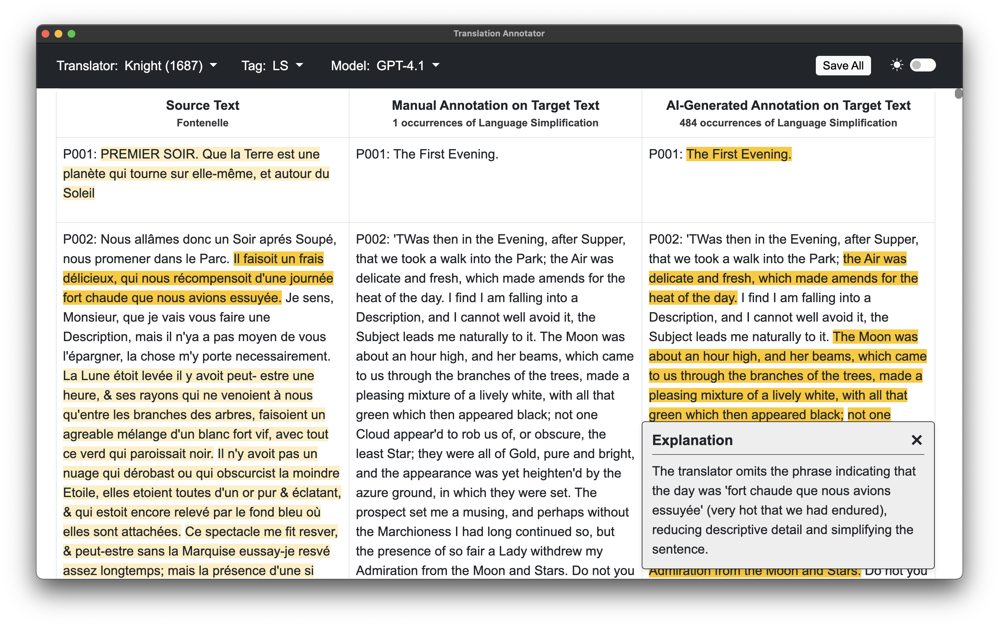

#  Translation Annotator



An Electron application to visualize and compare manual and AI-generated annotations of English translations of "Conversations on the Plurality of Worlds" by Bernard Le Bovier de Fontenelle, 1686. 

### Download links for Mac (ARM), Windows and Linux [here](https://github.com/fmilana/TranslationAnnotator/releases).

## Using the Application

Select the translator and tag to display in the navigation bar on the top left. 

The source text is shown in the left column, manual annotations on the target text in the middle column, and AI-generated annotations on the target text in the right column. 

Click on an annotation (highlighted text) either in the source text or in the AI-annotated target text to view an explanation for the annotation.

Click Save All to export all combinations of translator and tag as individual txt and xml files.

## Development

### Running the Application Locally

1. (Optional) create a conda environment

2. Clone the repository
   ```
   git clone https://github.com/fmilana/TranslationAnnotator.git
   ```
3. Navigate to the app directory
   ```
   cd TranslationAnnotator/app
   ```
4. Install dependencies
   ```
   npm install
   ```
5. Start the application
   ```
   npm start
   ```

### Data Processing Scripts

The Python scripts have already been run and processed data is included. If you need to reprocess the data:

1. Install required libraries from root folder:
   ```
   pip install -r requirements.txt
   ```

2. To extract and align paragraphs from source and translated texts:
   ```
   python src/preprocess.py
   ```

3. To make API calls to Anthropic to generate annotations:
   ```
   python src/call.py --translator [translator] --tag [tag]
   ```
   
   Note: Create a `.env` file in the root folder with your `ANTHROPIC_API_KEY`.

   **Translators:**
   - knight
   - behn
   - glanvill

   **Tags:**
   - IIM
   - SC
   - LS
   - RW
   - UP
   - NCE

   Note: The app will take some time to load each translator-tag combination.